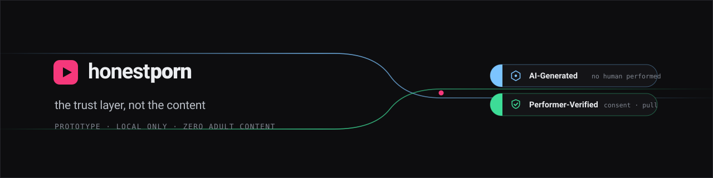
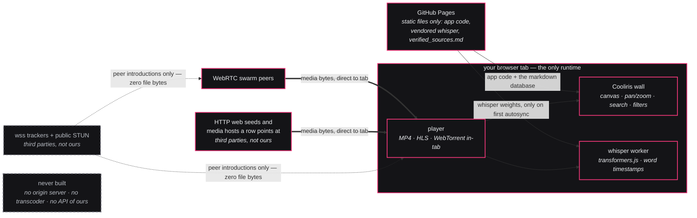
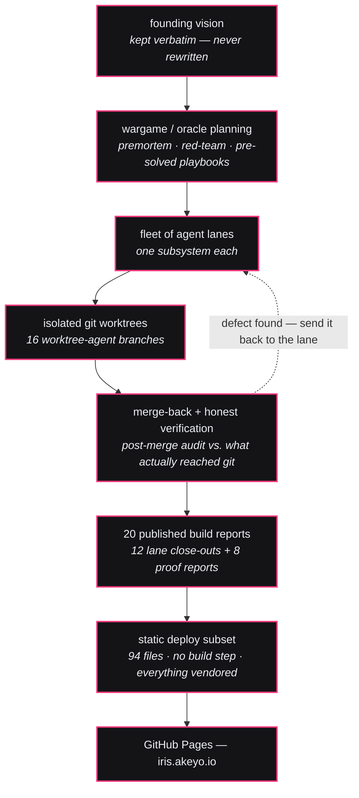

<div align="center">



[](https://iris.akeyo.io)
[](#-the-part-that-should-stop-you)
[](#-the-byte-path)
[](#-what-it-does)
[](#-quickstart)
[](https://iris.akeyo.io/reports/)
[](#-built-by-a-fleet-of-agents)
[](https://github.com/fire17/iris/stargazers)

**A media wall with no backend of its own: the torrent client runs in your tab, Whisper time-aligns the subtitles in that same tab, and the whole deploy is 94 static files on GitHub Pages.**

`no backend of ours` · `15 JS modules, no build step` · `markdown as the database` · `whisper in-tab, no CDN` · `zero adult content in this repo`

<sub>iris is the published deploy of <b>honestporn</b> — a consent-and-provenance trust layer for adult media. The tab title says so, and so does this line, before you click. The repo carries <b>zero adult content</b>: the registry ships seven SFW public test videos.</sub>

</div>

*Everything a skeptic can check is checkable. That is the whole design.*

**[🔭 The part that should stop you](#-the-part-that-should-stop-you)** · **[⚡ Quickstart](#-quickstart)** · **[🔀 The byte path](#-the-byte-path)** · **[🌐 Every server it talks to](#-every-server-it-talks-to)** · **[🧩 What it does](#-what-it-does)** · **[🔌 What is local-only](#-what-is-local-only-honestly)** · **[🧱 The physics limits](#-why-arbitrary-torrents-cannot-play-in-a-browser)** · **[🛠 How it was built](#-built-by-a-fleet-of-agents)**

---

## 🔭 The part that should stop you

The stack that normally needs an origin server, a transcoding farm, a subtitle service and a database is, here, a directory of files a static host hands out unchanged. **This project operates no server at all** — not one process, anywhere. Every claim below names the file you can read to check it.

- **The torrent client runs inside the tab.** A vendored WebTorrent 3.0.21 build (`vendor/webtorrent.min.js`, 222,929 bytes) is wrapped by [`js/torrent.js`](js/torrent.js). It only accepts magnets that carry a web seed or a fetchable `.torrent` (`ws=` / `xs=` / `wss=`); the gate is `canPlay()` at `js/torrent.js:130`. Everything else falls through to an honest copy-magnet panel ([`js/player.js:1207`](js/player.js)), never a dead play button.
- **The app measures its own byte path instead of asserting it.** `wireBreakdown()` in `js/torrent.js` buckets every wire as `webrtc`, `webSeed` or *other*, and sums the bytes each carried — so you can watch, live in the player panel, which transport actually fed you. That is the difference between a claim and an instrument.
- **Speech-to-subtitle-timing happens in your tab.** A vendored `transformers.js` 4.2.0 and the `whisper-tiny.en_timestamped` ONNX model compute true word-level timestamps (`return_timestamps: 'word'`, DTW over the model's alignment heads). Receipt: `js/whisper-tiny.js:60` sets `env.allowRemoteModels = false` with the comment `never hit a CDN at runtime`, and `localModelPath` plus the ONNX Runtime `wasmPaths` are both pinned to same-origin `/vendor/`. The weights are two files in this repo — `encoder_model_fp16.onnx` (16,477,869 B) and `decoder_model_merged_quantized.onnx` (30,729,881 B), **47.2 MB on disk, 33.4 MB gzipped over the wire.**
- **The database is a markdown table a human owns.** [`verified_sources.md`](verified_sources.md) — 7 rows today (4 `demo`, 2 `performer-verified`, 1 `ai-generated`), published and auditable at <https://iris.akeyo.io/verified_sources.md>. [`js/registry.js`](js/registry.js) is the only code that touches it and it only ever reads: one `fetch(FILE, {cache:'no-store'})` on load and every 2500 ms, with a **whole-body** string compare as the change detector — not `Last-Modified` (lies at one-second resolution), not `Content-Length` (defeated by an equal-length edit). Edit a row and it appears in the running app in about 3 seconds, no reload. There is no `POST`/`PUT`/`PATCH`/`DELETE`, no `XMLHttpRequest` and no `sendBeacon` anywhere in `js/`.
- **A registry typo can only remove a trust claim.** The parser bakes the badge into each item's display name — 🤖 `ai-generated` · ✅ `performer-verified` · 🧪 `demo` — and an unrecognized lane is assigned `demo` at `js/registry.js:79`. There is no spelling of anything that accidentally manufactures a ✅. *(A shipped gap in the neighbouring addon path is disclosed in [Defects](#defects-the-process-caught) — we found it, so we printed it.)*
- **All of it is 15 JavaScript modules** — 12,124 lines the day this was written, and the count moves as the app does, so re-derive it with `wc -l js/*.js` rather than trusting this sentence. No build step, no bundler, no runtime CDN. First page load is **under 600 KB uncompressed** (593 KB at the time of writing: `index.html` + `style.css` + all 15 scripts). Live now at **<https://iris.akeyo.io>** over HTTP/2 from GitHub Pages, alongside **20 published build reports** — 12 lane close-outs plus 8 standalone proof reports — at **<https://iris.akeyo.io/reports/>**.

**The boundary, stated plainly:** what plays are *web-seeded* torrents. Arbitrary TCP/uTP-only magnets — ordinary torrents with no web seed — do not play, and cannot in any browser: a browser can obtain bytes over exactly four transports (WebRTC, WebSocket, WebTransport, fetch/XHR) and a vanilla BitTorrent peer speaks none of them. Bridging that gap means putting a node in the byte path, which this project forbids itself. The full argument, with live measurements, is in **[Why arbitrary torrents cannot play in a browser](#-why-arbitrary-torrents-cannot-play-in-a-browser)**.

> [!IMPORTANT]
> A media wall that ships as static files, runs its torrent client and its speech recogniser in your tab, and keeps its database in a markdown file you can edit. Open <https://iris.akeyo.io> and check it before you believe it — and read [every server it talks to](#-every-server-it-talks-to), because "no backend of ours" is not the same sentence as "no servers".

---

## ⚡ Quickstart

Route 1 is instant. Route 2 is one command after a **149 MB clone** — 87 MB of that is the vendored Whisper weights and libraries, which is the price of never touching a CDN.

**1. Open it.** <https://iris.akeyo.io> — nothing to install, nothing to sign into.

**2. Run it yourself.**

```bash
git clone https://github.com/fire17/iris && cd iris && python3 -m http.server 8060
```

Then open <http://localhost:8060>. That is the whole build step — there is no build step. Static files, any static file server, any port.

### Then try this

| # | Do this | What you should see |
|---|---|---|
| 1 | Click any 🧪 **demo** row on the wall | Direct MP4 or HLS playback, straight from the source URL in the registry |
| 2 | Click the **web-seeded torrent** row (`Sintel (torrent — no server)`) | The torrent client runs in your tab. Open the torrent panel and read `wireBreakdown` — it tells you how many bytes came from WebRTC peers and how many from the HTTP web seed |
| 3 | Open a video with subtitles → turn on **autosync** | Whisper downloads *at that moment*, runs in the tab, and word-timestamps sparse ~16–22 s audio windows to re-time the cues — never the whole film |

> [!NOTE]
> Step 3 is the only heavy download in the app, and it is genuinely deferred: page load fetches just a **2,197-byte `config.json` probe** to decide whether the model is present ([`js/whisper-tiny.js:113`](js/whisper-tiny.js)). The weights — **47.2 MB on disk, 33.4 MB gzipped** — arrive only on your first autosync, together with the ONNX Runtime WASM, the tokenizer and the library (roughly **40 MB gzipped in total**). Same origin, no CDN. If the model is absent the probe fails and the app quietly stays on a deterministic mock instead of breaking.

### The database is a markdown file

Open `verified_sources.md`, edit a row, save. The running tab picks it up in about 3 seconds — no reload, no rebuild, no restart, because the client re-fetches with `cache:'no-store'` every 2500 ms and diffs the whole body.

The app only ever `GET`s that file. There is no write path in any of the 15 modules — your table is yours.

---

## 🔀 The byte path

The claim worth checking is not that this is fast — it is that **no machine this project runs is anywhere in the path**, because this project runs no machine. GitHub Pages hands your browser the app code and, on demand, the vendored Whisper weights. After that, media arrives from swarm peers and from the third-party hosts a registry row points at, straight into the tab.



> [!WARNING]
> **The nuance everyone should attack first.** A magnet's `ws=` parameter is an HTTP **web seed** — an ordinary web server someone else runs. `js/torrent.js` fetches the `xs=` `.torrent` from that host on every play of the shipped Sintel row, so a third-party HTTP request happens unconditionally for it. When the swarm has WebRTC peers, bytes arrive peer-to-peer; when it does not, the same client falls back to the web seed over HTTPS — and two independent live probes of that infohash returned **zero** peer offers. So: **no node this project runs is in the byte path** — true, and the rule we actually hold ourselves to. **"Pure peer-to-peer"** — not something we will claim for the shipped demo row. The project's own audit found exactly that, and it is written into [the transport-law verdict](https://iris.akeyo.io/reports/physics-verdict.html) rather than argued away.

---

## 🌐 Every server it talks to

A page that says "no backend" owes you the list. This is it — observed by grepping every hardcoded host out of the shipped JavaScript, not summarised from intent. **None of these is operated by this project.**

| Host | When | What for |
|---|---|---|
| `iris.akeyo.io` (GitHub Pages) | always | Serves the app, the vendored Whisper weights and `verified_sources.md`. It is an origin server — GitHub's, not ours. |
| `v3-cinemeta.strem.io` → `cinemeta-catalogs.strem.io` | **on first page load, no user action** | The Stremio metadata addon auto-installs when no addons are configured (`js/addons.js:723`), and the home view reads catalogs from it. This is a third-party API backed by a third-party database. |
| `images.metahub.space` | with Cinemeta catalogs | Poster images referenced by the catalog JSON. |
| `opensubtitles-v3.strem.io` | on subtitle search | Hardcoded default subtitle source, appended to whatever addons you installed (`js/player.js:21`, `js/subs-autosync.js:50`). |
| `wss://tracker.openwebtorrent.com`, `wss://tracker.webtorrent.dev`, `wss://tracker.btorrent.xyz` | on torrent playback | Peer introductions. Signaling only — they never carry file bytes. |
| `stun.l.google.com:19302`, `global.stun.twilio.com:3478` | on torrent playback | WebTorrent's built-in STUN defaults, for WebRTC address discovery. No TURN is configured, so nothing relays media. |
| `thumb.live.mmcdn.com` | on live-cam tiles | Thumbnail images for live rooms. |
| whatever host a registry row points at | on play | The media itself. Today: `test-videos.co.uk`, `media.w3.org`, `test-streams.mux.dev`, `webtorrent.io`. |
| `127.0.0.1:11470` / `127.0.0.1:11471` | only if you run them | Optional local helpers (torrent engine, live-cam resolver). Probed behind short timeouts; absent means the feature degrades, nothing hangs. |

**What is genuinely absent, checked by grep across `js/` and `index.html`:** no analytics, no telemetry, no error reporting, no accounts, no cookies set by the app, no CDN for the ML stack, no transcoder — and no server of ours anywhere in that table.

---

## 🧩 What it does

Every row is a shipped module in this repo — 15 of them in `js/`, and the file named in the last column is the one that does the work. Line counts move with the app; `wc -l js/*.js` is the authority, not this page.

| Capability | How it works | Where to look |
|---|---|---|
| Cooliris-style canvas wall | One canvas, pan/zoom, no DOM node per tile — search, filters and category nav all draw against the same scene | [`js/wallview.js`](js/wallview.js) |
| Live registry watch | Re-fetches `verified_sources.md` every 2500 ms with `cache:'no-store'` and diffs the **whole body**, so an edited row shows up in ~3 seconds with no reload | [`js/registry.js`](js/registry.js) |
| Provenance badges | The parser bakes the badge into each item's display name; an unrecognized lane is assigned `demo` at line 79, never promoted | [`js/registry.js`](js/registry.js) |
| Direct MP4 playback | Plain `<video>` against the source URL — click to frame, nothing in between | [`js/player.js`](js/player.js) |
| HLS streams | Segmented playback on the same player surface as MP4, via vendored `hls.js` (385,164 B) — the wall behaves identically either way | [`js/player.js`](js/player.js) · [`vendor/hls.js`](vendor/hls.js) |
| In-tab torrent client | Vendored WebTorrent 3.0.21 as `window.BT`, gated to magnets with `ws=` / `xs=` / `wss=`. A 25-second stall guard destroys the torrent and shows the copy-magnet panel rather than spinning forever | [`js/torrent.js`](js/torrent.js) |
| Subtitles | Every installed addon that declares subtitle support, plus OpenSubtitles v3 as an always-appended default. SRT / SSA-ASS / VTT → clean WebVTT, with BOM and charset sniffing (utf-8, utf-16le/be, windows-1251/1252) | [`js/addons.js`](js/addons.js) · [`js/player.js`](js/player.js) |
| In-browser Whisper autosync | `transformers.js` 4.2.0 + ONNX Runtime, both vendored same-origin, computing word-level timestamps over **sparse ~16–22 s anchor windows** — never the whole film. Runs as a background hot-swap after the raw cues are already on screen, so playback never waits | [`js/subs-autosync.js`](js/subs-autosync.js) · [`js/whisper-engine.js`](js/whisper-engine.js) · [`js/whisper-tiny.js`](js/whisper-tiny.js) |
| Audio windowing for autosync | Pulls only the sample window the recogniser needs out of the playing media — MP4, HLS and MPEG-TS each get their own path | [`js/subs-audio-source.js`](js/subs-audio-source.js) · [`js/subs-mp4-window.js`](js/subs-mp4-window.js) · [`js/subs-hls-map.js`](js/subs-hls-map.js) · [`js/subs-ts-window.js`](js/subs-ts-window.js) |
| Addon protocol catalogs | Stremio-protocol manifests supply extra catalogs and subtitle providers through one surface | [`js/addons.js`](js/addons.js) |
| Static shell | Boot, wall, routing and state. There is no backend to be down | [`js/app.js`](js/app.js) |
| Dev instrumentation | Network monitor and a localhost-only dev panel — `js/dev.js` returns immediately off localhost | [`js/netmon.js`](js/netmon.js) · [`js/dev.js`](js/dev.js) |

---

## 🔌 What is local-only, honestly

Four things do not work on <https://iris.akeyo.io>. Knowing exactly which four is the reason you can trust the table above — each row says *why*, and each degrades into something honest rather than a dead button.

| Feature | Works live? | Why | What you get instead |
|---|---|---|---|
| Chaturbate **live cam** resolve | **No** | `chaturbate.com`'s `get_edge_hls_url_ajax` endpoint returns HTTP 200 but sends no `Access-Control-Allow-Origin`, so a fetch from `iris.akeyo.io` is CORS-blocked. Resolving it needs a local hop at `127.0.0.1:11471` | `resolverUp()` probes `/health` with an 800 ms timeout and caches `false` on any rejection, so the path simply falls through. The public deploy carries only SFW placeholder rows, so there is nothing live to resolve |
| Arbitrary **TCP/uTP-only magnets** | **No** | Browser transport physics, not a missing feature — see [the proof](#-why-arbitrary-torrents-cannot-play-in-a-browser) | An honest **copy-magnet** panel: a readonly textarea and a copy button. Take the magnet to a client that speaks TCP |
| Optional **node torrent engine** at `127.0.0.1:11470` | **No** | Not deployed, and not needed | Nothing is lost: web-seeded magnets run in the tab without it. The engine is additionally behind an explicit opt-in, so it is never probed unless you ask |
| Browser-to-browser **self-seeding** (you bring the file) | **Not shipped** | This is the one law-compliant P2P mode, and it was *proven* during the build — but the code for it lives in the project's proof harness, not in the deployed app | The published [relay-punch evidence](https://iris.akeyo.io/reports/relay-punch.html) — screenshots and timeline JSON — rather than a feature that isn't there |

Everything else works on the public static site: the wall, search / filters / categories / nav, direct MP4, HLS, web-seeded torrents in the tab, subtitles, and in-browser Whisper autosync.

<details>
<summary><b>Three more gaps we would rather you heard from us</b></summary>

- **English only.** `js/whisper-tiny.js:28` declares a multilingual model id, but that model directory is not vendored — and with `allowRemoteModels = false` there is no fallback. Autosync is `whisper-tiny.en`, full stop.
- **WASM only, single-threaded.** WebGPU q4f16 weights are deliberately not vendored, and GitHub Pages cannot send COOP/COEP headers, so the page is never cross-origin isolated and ONNX Runtime forces `numThreads = 1`. That is a *speed* ceiling, not a failure — the runtime falls back rather than throwing — but no throughput claim on this page should be read as multi-threaded.
- **CORS limits autosync on some demo rows.** Of the 12 HTTP URLs in the registry, 8 send `access-control-allow-origin: *` and 4 do not. Those 4 play fine, but the autosync audio-window reader cannot range-read them.

</details>

---

## 🧱 Why arbitrary torrents cannot play in a browser

We tried to break our own rule. We failed, and we published the proof instead of quietly shipping a server: **[the transport-law verdict](https://iris.akeyo.io/reports/physics-verdict.html)**, measured against a real, healthy swarm.

> **Measured, not asserted** — from the published verdict page, for the target infohash: **54** max seeders and **76** TCP peers handed out, and **0** browser-reachable WebRTC seeders, against a random-control infohash that also returned 0. Five adversarial workflows of roughly 55 agents re-derived the same wall independently: **38 dead-ends, 7 "bypass-possible" paths, and exactly 2 documented boundaries** — every one of the 7 collapsing into one of those 2.

1. A browser can obtain bytes over exactly **four** transports: WebRTC, WebSocket, WebTransport, fetch/XHR. There is no fifth.
2. Each of those four requires the far end to speak the same protocol — ICE/DTLS/SCTP, an HTTP(S)/QUIC upgrade, or an HTTP server.
3. A vanilla BitTorrent peer speaks raw TCP or uTP only. It answers none of the four, and it cannot be asked to change.
4. Signaling relays — which our rule *does* allow — change **introductions, not protocol**. Perfect signaling still leaves no peer the browser can complete a byte channel with. TURN would work, but a TURN server relays the media by definition, which puts a node in the byte path.
5. So the only way those bytes reach a tab is a node that speaks TCP/uTP to the swarm and re-serves over a browser transport — exactly the thing this project forbids itself.
6. **The bootstrap paradox:** a browser-only WebRTC swarm cannot self-start either. To seed over WebRTC you must already hold the bytes, and for TCP-only content the genesis browser could only have gotten them from a byte-path node. One violation at genesis, or no swarm ever.
7. **Two genuine boundaries survive.** (a) *You bring your own bytes* — a local file seeds browser→browser with no node in the byte path. (b) *A third-party HTTP mirror* — a plain `<video src>` is the same class as any ``; clean, but it does not generalize (a mirror must exist, CORS is usually absent, and typical MKV/AC3 releases fail `MediaSource.isTypeSupported` outright).
8. **Watch-list — what would flip this verdict:** qBittorrent 5.3 shipping WebTorrent, libtorrent 2.1.x adoption, and Direct Sockets reaching normal web pages. The last is the biggest lever, and today it is Isolated-Web-App-only.

So the app does not ship a dead play button for those magnets. It offers you the magnet to copy. That is not a missing feature — it is the honest edge of the physics.

<details>
<summary><b>The dead-end inventory — what was actually tested, and how each one died</b></summary>

| Path | Outcome |
|---|---|
| **Direct Sockets / raw TCP from a page** | Dead. On a plain `https://` page `TCPSocket` / `UDPSocket` / `TCPServerSocket` are `undefined`. Force-enabled, the renderer is killed on first `socket.opened`: *"Frame is not sufficiently isolated to use Direct Sockets."* Chromium source only admits `isolated-app://` and the ChromeOS terminal origin. Firefox position Negative, Safari no signal. |
| **WebTransport / RTCQuicTransport** | Dead. Dialing with `serverCertificateHashes` at a dual TCP+UDP listener emitted QUIC-v1 UDP Initial packets and **zero** bytes on the TCP socket — pinning replaces CA validation, it does not remove the QUIC handshake the far end must speak. RTCQuicTransport is archived at W3C. |
| **IPFS / Helia** | Transport half is genuinely clean — real blocks pulled peer→browser over `webrtc-direct`, with no node of ours in the path. Content half is absent: no name→CID index, no infohash→CID mapping (SHA-1 pieces vs sha2-256 chunks), and real providers are pinning **servers**. Trap recorded: default `createHelia` silently adds HTTP block brokers — a byte path unless explicitly disabled. |
| **Browser as a WebRTC DHT node** | Dead, source-confirmed. Hybrid peers exchange WebRTC offers over WebSocket trackers only; real magnets carry no `wss` rendezvous. A page can emit UDP only inside ICE/DTLS or QUIC — never bare KRPC to a DHT node. |
| **Public bridges / gateways** | `webtor.io`: server pods join the swarm and a CDN serves the bytes — byte path by design. `instant.io` / `btorrent.xyz`: architecturally clean, but a live announce of a real TCP-only infohash returned zero peer offers. Debrid: an obvious byte carrier. |

The harness, its captured output and the individual gates live in the project source under `test/novel-path/` — signaling and handshakes only, zero file bytes touched — and the captured output is reproduced on [the verdict page](https://iris.akeyo.io/reports/physics-verdict.html).

</details>

---

## 🛠 Built by a fleet of agents

No solo human wrote this. It was designed, built, verified and documented by a fleet of Claude Code agents working in isolated git worktrees, one lane per subsystem, merged back and audited by an orchestrator session.

**What that looks like as evidence rather than as a story** (observed 2026-08-23 in the source repository):

| Receipt | Observed |
|---|---|
| Commits | 97, the first 95 of them inside a single day — `2026-08-21 13:48:40` to `22:40:59`, a span of 8 h 52 m |
| Agent isolation | 17 branches, **16** of them named `worktree-agent-<hash>` — one per isolated lane — and 11 registered worktrees |
| Lane traffic | 22 commit subjects mention a lane, the swarm or an agent |
| Authorship trailers | 39 commits stamped `Claude Opus 4.8`, 21 stamped `Claude Fable 5` |
| Close-outs | 20 report pages, all published at [`/reports/`](https://iris.akeyo.io/reports/) — 12 lane close-outs and 8 proof reports — with screenshot and timeline-JSON evidence beside them |



> [!NOTE]
> **Where the honest line falls.** `.grand/SWARM.md` in the source repo is the orchestration plan — its own header says the exit contract was *written before spawn* — so its lane table records what was **assigned**, not what was measured. The receipts above are the measured half. That same file also logs a downgrade against its own intent: the lanes were in-process subagents with no OS session of their own, so they could not raise themselves to the highest effort tier without mutating the parent session, and ran one tier lower. It is written down rather than quietly claimed.

### Lane roster

Eleven lanes are named in the orchestration plan; each has a published close-out.

| Lane | What it owned | Report |
|---|---|---|
| `hp-player` | `js/app.js` — click-to-play verified and fixed; registry items in search; registry continue-watching | [report](https://iris.akeyo.io/reports/hp-player.html) |
| `hp-trust` | `index.html`, `style.css`, `js/registry.js` — badge chrome and lane visuals, skipped-row surface, empty states | [report](https://iris.akeyo.io/reports/hp-trust.html) |
| `hp-motion` | `js/wallview.js`, `js/player.js` — tile-level lane badges on canvas, player chrome, HLS and live glyphs | [report](https://iris.akeyo.io/reports/hp-motion.html) |
| `hp-showcase` | `.grand/showcase/`, `.grand/dev/`, `IA.md`, `PATTERNS.md`, `README.md` — showcase sites and information architecture | [report](https://iris.akeyo.io/reports/hp-showcase.html) |
| `hp-quality` | Read-only on code: budget battery runs, code and security review, findings routed back through the orchestrator | [report](https://iris.akeyo.io/reports/hp-quality.html) |
| `hp-catalog` | `js/addons.js` + the board region of `js/app.js` — catalog, search, filters, categories, `stremio://` URL handling | [report](https://iris.akeyo.io/reports/hp-catalog.html) |
| `hp-addons` | `js/addons.js` — completing the half-landed addon data layer: manifest rewriting, `external` stamping, `hasMore` paging | [report](https://iris.akeyo.io/reports/hp-addons.html) |
| `hp-responsive` | `style.css`, `index.html` — the small-screen sweep no other lane covered | [report](https://iris.akeyo.io/reports/hp-responsive.html) |
| `hp-nav` | `js/wallview.js` — rows control, board zoom/pan/navigate feel, without regressing the home camera | [report](https://iris.akeyo.io/reports/hp-nav.html) |
| `hp-stream` | `js/player.js`, `js/app.js` — in-house HLS playback, muted hover autopreview | [report](https://iris.akeyo.io/reports/hp-stream.html) |
| `hp-resolver` | `server/resolver/resolver.py` — the local-only live-cam resolver on `127.0.0.1:11471`, stdlib only, graceful when absent | [report](https://iris.akeyo.io/reports/hp-resolver.html) |

### The proof reports

Separate from the build lanes, several reports exist only to prove or disprove a claim. These are the ones a skeptic should open first.

| Report | What it settles |
|---|---|
| [The transport-law verdict](https://iris.akeyo.io/reports/physics-verdict.html) | Why an arbitrary TCP/uTP-only magnet cannot reach a browser tab — the four-transport argument, with the live swarm measurement behind it |
| [Browser torrent P2P](https://iris.akeyo.io/reports/torrent-p2p.html) | What browser torrent transfer actually looked like when it worked |
| [P2P torrent solver](https://iris.akeyo.io/reports/p2p-torrent-solver.html) | The end-to-end torrent-plus-stream path, wired into the app |
| [Relay punch](https://iris.akeyo.io/reports/relay-punch.html) | Signaling-path evidence, with the raw screenshots and timeline JSON kept beside the report |
| [Verify and harden](https://iris.akeyo.io/reports/verify-harden.html) | Adversarial pass over the whole browser-only P2P stack |
| [Browser-only live subtitles](https://iris.akeyo.io/reports/subtitles.html) | Subtitle fetch, SRT/SSA→VTT conversion, in-browser Whisper sync |
| [Window-scoped subtitle audio](https://iris.akeyo.io/reports/subs-stream-audio.html) | How autosync gets the audio for a window without downloading the whole file |
| [Quality round 1](https://iris.akeyo.io/reports/quality-round1.html) | The review battery's first full sweep, and what it found |

### Defects the process caught

Naming these is the point. A build log with no defects in it is a build log nobody checked.

- **GitHub's secret scanner fired on a machine-learning class name.** Push protection blocked the very first push of this repo over `Mistral3ForConditionalGeneration` inside the vendored `transformers.js` — a model architecture name that pattern-matches a credential. False positive; nothing secret was ever in the tree. The fix is in the deploy repo's reflog, verbatim: *`vendor: split Mistral3ForConditionalGeneration literal (GitHub secret-scanner false positive)`*. You can confirm the mitigation in the shipped bytes — the contiguous literal appears **zero** times in this repo, and the split form `"Mistral3For" + "ConditionalGeneration"` appears exactly once in each of the two vendored bundles. *(Honest framing: the scanner caught the string; the build process diagnosed it as a false positive and worked around it.)*
- **A lane reported work that never reached git.** `hp-catalog` closed out claiming changes to `js/addons.js` — manifest rewriting, `external` stamping, `hasMore` paging. The orchestrator's post-merge audit found `js/app.js` calling an API that `js/addons.js` did not have. The gap was written into `SWARM.md` as a KNOWN GAP, *including* its honesty consequence — addon content was rendering without its unverified-source marker until the fix landed — and a follow-up lane, `hp-addons`, was spawned to own the completion.
- **The repo's own demo row overstated itself.** A row labelled *"Sintel (torrent — no server)"* was audited and found to resolve via an HTTP web seed — a real, working stream, but not browser-to-browser peer transfer. The finding went into the verdict rather than being argued away, and [the byte-path section](#-the-byte-path) states the nuance up front.
- **Trust escalation is enforced in the registry parser, not app-wide.** The review that produced this README found it: `js/registry.js` never promotes an unknown lane, but the addon path only stamps metas as `external` — it does not strip a `lane` field. A third-party addon that returned `"lane":"performer-verified"` would currently render the verified badge. It contradicts the honesty law written in `js/addons.js` itself, so it is a shipped defect, printed here rather than discovered by someone else.
- **A "done" feature was recorded as not verified.** Click-to-play for registry sources was carried into the fleet baseline (`.grand/ADOPTED.md`) marked **NOT live-verified**, booked as OPEN, assigned to a lane, and closed only after a lane fixed and observed it.
- **Demo sources rotted mid-build.** A host used by the seed rows started refusing requests. The pre-mortem had flagged demo-URL rot as a live risk; when it fired, the sources were swapped to hosts that were then re-probed, and the incident went into the field log instead of being silently patched.

### How claims here are enforced

There is **no CI on this repo.** The deployed tree carries no `.github/workflows` directory and no workflow file at all — checked, not assumed. There is no build step to go green, and this README will not show you a badge pretending otherwise.

What enforces the claims instead:

1. **Every lane published a close-out report** — 12 of them, plus 8 standalone proof reports: 20 static pages under [`/reports/`](https://iris.akeyo.io/reports/), served from the same origin as the app, with their screenshot and timeline evidence beside them.
2. **The physics verdict is a reproducible harness, not an opinion.** The impossible case is demonstrated by a test you can re-run, which is why the app offers a copy-magnet panel instead of a dead play button.
3. **The app instruments its own central claim.** `wireBreakdown()` reports bytes by transport, so the byte-path claim is measurable in the running player rather than only assertable in a README.
4. **Every number on this page was observed by command** — line counts, byte sizes, gzip transfer sizes, HTTP status codes, file and commit counts. What could not be observed is listed below rather than omitted.

> [!IMPORTANT]
> **Not verified in this pass, stated plainly.** No browser was driven while writing this README. Wall rendering, search, filters, playback and an end-to-end Whisper transcription are *HTTP-plausible* — every asset returns 200, every shipped script parses, every registry source range-serves — but they were **not observed running**. Likewise the fleet's model tiers: the commit trailers above are the evidence, and no per-agent model artifact survives on disk. If any claim here does not survive contact with <https://iris.akeyo.io>, the claim is the thing that is wrong. Open an issue against it.

---

## 🛟 Safety and undo

Short version: it stores a little in your browser, sends nothing to us because there is no us to send it to, ships no adult content, and you stop it by killing one process and deleting one folder.

| Question | Answer |
|---|---|
| What does it store? | Two things, both local. **(1) `localStorage`**, only your own preferences: `cw` and `hp.cw.open` (continue-watching), `cs.library`, `cs.ui`, `hp.board.v1` (layout per category), `hp.qfilter` (disabled quality labels), `plr.vol` and `plr.muted`, `hp.subs.cfg` (subtitle and autosync settings), `hp.torrent.localEngine` (the local-engine opt-in), and `hp.bt.panel` / `hp.bt.settings` / `hp.bt.torrents` (torrent panel state). **(2) A service worker** — `js/torrent.js:93` registers `/sw.min.js` at scope `/` the first time you play a torrent, so the stream can be handed to the `<video>` element from inside your own browser. Neither leaves your machine. |
| What does it send to *us*? | Nothing — we operate no server. No analytics, no telemetry, no error reporting, no accounts, no cookies set by the app. Everything it *does* contact is [listed above](#-every-server-it-talks-to). |
| Does the AI run in the cloud? | No. Whisper runs in your tab, from weights served by the same origin, with `env.allowRemoteModels = false`. No inference API, no upload of your audio. |
| What content is in this repo? | **Zero adult content.** The registry is 7 rows of SFW public test media — they exist to prove the transports and the badges work. |
| How do I run it myself? | `python3 -m http.server 8060` from the repo root, then open <http://localhost:8060>. Any static file server, any port. |
| How do I stop it, completely? | Kill the `http.server` process, delete the folder, then clear the browser side: DevTools → Application → Storage → **Clear site data**, which unregisters the `/sw.min.js` service worker and drops every `localStorage` key above. Deleting the folder alone leaves that registration behind. No daemon, no installed service, no database, no account to close. |
| What would an operator still have to build before real content? | **Age verification, moderation, and likeness screening — none of which are built.** That is a standing gate, not a to-do: the player is finished; the trust infrastructure a real deployment would need is not. |
| What is the hard law? | **CSAM: never.** No exception, no configuration, no operator override. |

> [!WARNING]
> This is a **player and a trust-layer prototype**, not a platform. It ships with a SFW test registry precisely because the consent, age-verification and moderation layers that real content requires do not exist here.

---

## ⭐ Check the claims

This project's only real asset is that its claims are checkable. So the ask is not "please star."

The ask is: **go break one.**

- Open <https://iris.akeyo.io>, then DevTools → Network, play something, and find a **media** byte served by an origin this project operates. App code and the Whisper weights come from ours; video bytes never should. There is also a [published list](#-every-server-it-talks-to) of every host it contacts — find one that is not on it.
- Play the torrent row and read `wireBreakdown` in the panel. If bytes came from somewhere the byte-path section didn't warn you about, that is a finding.
- Clone it, edit a row in `verified_sources.md`, and time how long it takes to appear.
- Read [the transport-law verdict](https://iris.akeyo.io/reports/physics-verdict.html) and find the hole in the impossibility argument.
- Check the provenance rule against [`js/registry.js`](js/registry.js) line 79 and confirm an unknown lane really does fall to `demo`, never upward.

If a claim does not hold, open an issue — that is worth more than a star. If they all hold, a star is you saying so publicly, and that is the one part we cannot do ourselves.

[](https://star-history.com/#fire17/iris&Date)

---

## 🔗 Related

- **Live site** — <https://iris.akeyo.io>
- **Dev Showcase — 20 build reports (12 lane close-outs + 8 proof reports)** — <https://iris.akeyo.io/reports/>
- **The registry, published and auditable** — <https://iris.akeyo.io/verified_sources.md>
- **Source** — <https://github.com/fire17/iris>

### Standing on other people's work

Vendored into `vendor/`, unmodified except where noted, and credited because they did the hard parts: [WebTorrent](https://github.com/webtorrent/webtorrent) 3.0.21 (MIT), [hls.js](https://github.com/video-dev/hls.js) (Apache-2.0), [transformers.js](https://github.com/huggingface/transformers.js) 4.2.0 and [ONNX Runtime Web](https://github.com/microsoft/onnxruntime) (both Apache-2.0), and the [`onnx-community/whisper-tiny.en_timestamped`](https://huggingface.co/onnx-community/whisper-tiny.en_timestamped) model, derived from OpenAI's [Whisper](https://github.com/openai/whisper) (MIT). Catalog metadata comes from [Cinemeta](https://www.stremio.com/) and subtitles from [OpenSubtitles](https://www.opensubtitles.org/) via the Stremio addon protocol.

## 📄 License

**No license file is shipped yet, so all rights are reserved by default.** That is a state, not a position — a license is being chosen, and this line will name it and link it the moment one lands. Everything under `vendor/` keeps its own upstream license; they are listed just above.

---

<div align="center">
<sub><i>No node of ours in the byte path — because there is no node of ours. No claim without a receipt. Where we could not do it, we said so and showed the work.</i></sub>
</div>
